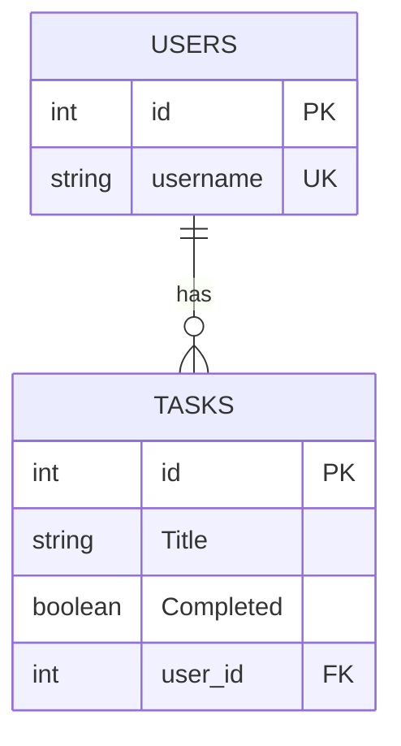

# Task Manager API — ER Diagram

```mermaid
erDiagram
    USERS ||--o{ TASKS : has

    USERS {
        int id PK
        string username UK
    }

    TASKS {
        int id PK
        string Title
        boolean Completed
        int user_id FK
    }
```
